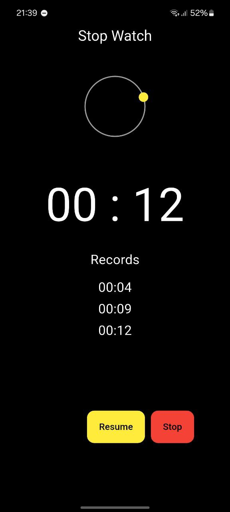

# Stop Watch

Stop Watch.
Classico cronometro che, una volta avviato, mostra i minuti e i secondi e consente di registrare dei records.
L'applicazione è dotata di due pulsanti, il primo avvia, ferma e ripristina il cronometro (START, STOP e RESET), il secondo, visualizzabile dal momento che si preme Start fino a quando non si preme Stop, mette in pausa il cronometro registrando il record e lo fa riprendere (PAUSE e RESUME).




## Scelte di sviluppo

All'avvio dell'app, uno Stream genera ogni 10 millisecondi un evento (numero intero che parte da 0).
Un altro Stream, all'avvio del cronometro, si mette in suo ascolto e genera ogni secondo un valore (conteggio dei secondi).
Il numero intero generato dal primo Stream viene utilizzato per memorizzare il tempo in cui il cronometro si ferma, in modo da riprendere il conteggio dei secondi correttamente, mediante una semplice sottrazione, quando si preme Resume.


## Requisiti

- Flutter SDK
- Android Studio

L'ambiente deve essere configurato correttamente, il seguente comando da digitare sul prompt dei comandi fornirà indicazioni sullo stato configurazione:
```bash
flutter doctor
```

## Download del progetto

Questa applicazione funziona per i dispositivi Android.
È possibile scaricare questo progetto selezionando il percorso desiderato dal prompt dei comandi e digitando:
```bash
git clone https://github.com/LeoF-07/stop_watch.git
```

Se i [Requisiti](#Requisiti) sono rispettati sarà possibile modificare il progetto con Android Studio o Visual Studio Code ed emularlo.


## Emulazione dell'applicazione

L'emulazione dell'applicazione può avvenire o con i dispositivi virtuali che Android Studio mette a disposizione oppure su un dispositivi fisico personale. Se si sceglie di eseguire il debug con questa seconda opzione è necessario seguire questi passaggi:
1. Collegare il dispositivo al PC tramite un cavo USB.
2. Assicurarsi che il **debug USB** sia attivo nelle Opzioni sviluppatore del dispositivo Android.
3. Verificare che il dispositivo sia riconosciuto e ottenere l'id del dispositivo con:
```bash
futter devices
```
4. Digitare nel prompt dei comandi all'interno della cartella del progetto:
```bash
flutter run -d <device-id>
```

## Creazione APK

L'APK può essere creato direttamente del Menu di Android Studio nella sezione Build, oppure è sufficiente digitare questo comando nel prompt dei comandi all'interno della cartella del progetto:
```bash
flutter build apk --release
```

Nella sezione [Releases](https://github.com/LeoF-07/stop_watch/releases) della repository è presente l'APK da scaricare senza bisogno di aprire il progetto con un IDE.


Trasferendo l'apk su un dispositivo Android potrà essere scaricato e l'applicazione sarà pronta all'uso.


## Autore
Leonardo Fortin
